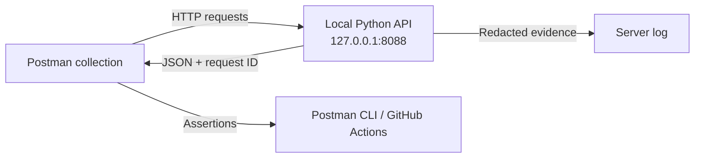

# Postman TSE Incident Lab

[](https://github.com/h-vance/postman-tse-incident-lab/actions/workflows/verify.yml)

A self-contained portfolio project demonstrating evidence-first API troubleshooting with Postman. The lab reproduces four customer-facing incidents, verifies each diagnosis with automated tests, and documents the customer response or engineering handoff a Technical Support Engineer should provide.

All customers, credentials, identifiers, and events in this repository are fictional.

## 60-second recruiter overview

This project demonstrates that I can:

- Reproduce API failures instead of guessing at causes.
- Distinguish authentication (`401`) from authorization (`403`).
- Diagnose route errors (`404`) and rate limiting (`429`).
- Use environments, API keys, Bearer tokens, headers, query parameters, and JSON bodies in Postman.
- Correlate a client request with server evidence using a request ID.
- Separate confirmed facts from hypotheses.
- Protect credentials while gathering useful evidence.
- Write concise customer updates and decide when engineering escalation is necessary.

## Incident matrix

| Incident | Failure evidence | Corrective evidence | Investigation |
|---|---|---|---|
| Revoked API key | `401 api_key_revoked` | `202 accepted` | [Read case](incidents/001-revoked-api-key/README.md) |
| Insufficient permissions | `403 insufficient_scope` | `200 authorized` | [Read case](incidents/002-insufficient-permissions/README.md) |
| Incorrect endpoint | `404 route_not_found` | `200 found` | [Read case](incidents/003-incorrect-endpoint/README.md) |
| Rate-limited client | `429` with `Retry-After` | `200 within_limit` | [Read case](incidents/004-rate-limited-client/README.md) |

## Architecture



The API uses only the Python standard library and binds to loopback. Each failure is deterministic so the collection can be rerun locally and in CI.

## Quick start

Prerequisites:

- Python 3.11+
- [Postman CLI](https://learning.postman.com/docs/postman-cli/postman-cli-overview/)

Run the complete automated verification:

```bash
git clone https://github.com/h-vance/postman-tse-incident-lab.git
cd postman-tse-incident-lab
make verify
```

`make verify` starts the lab API temporarily, runs all eight Postman requests and their assertions, checks that raw credentials never entered the server log, and then stops the API.

## Run manually in Postman

1. Start the API:

   ```bash
   make serve
   ```

2. Import both files from `postman/` into Postman Desktop.
3. Select the **TSE Local Lab** environment.
4. Open **TSE API Incident Lab** and run the collection.
5. Compare each failing request with its corrected version.
6. Use the `X-Request-ID` response header to correlate Postman evidence with the terminal log.

## Repository structure

```text
.
├── lab_api.py
├── postman/
│   ├── tse-api-incident-lab.postman_collection.json
│   └── tse-local-lab.postman_environment.json
├── incidents/
│   ├── 001-revoked-api-key/
│   ├── 002-insufficient-permissions/
│   ├── 003-incorrect-endpoint/
│   └── 004-rate-limited-client/
├── scripts/verify.sh
└── .github/workflows/verify.yml
```

## Evidence and secret handling

- Only synthetic demo credentials are committed.
- The API maps known demo credentials to synthetic fingerprints.
- Raw credentials are never written to server logs or response bodies.
- Collection tests fail if a response contains any configured credential.
- Production credentials should live in a private Postman environment or Postman Vault and should never be committed.

## Design choices

- Postman Collection v2.1 keeps the artifacts portable and directly importable.
- Postman CLI runs the same collection locally and in GitHub Actions.
- A tiny local API makes every incident reproducible without relying on a third-party service.
- Failure and corrected requests sit side by side so the evidence difference is visible.

## License

[MIT](LICENSE)
